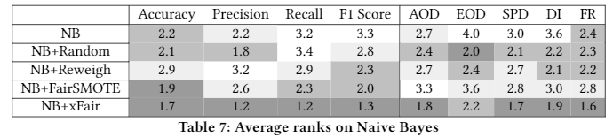

# xFAIR

### Results using Naive Bayes as base model(as requested)

The following is a summary chart. Better cells in each column are marked in darker colors.

</img>

For full details regarding each dataset, please see [NB.xlsx](./NB.xlsx).
